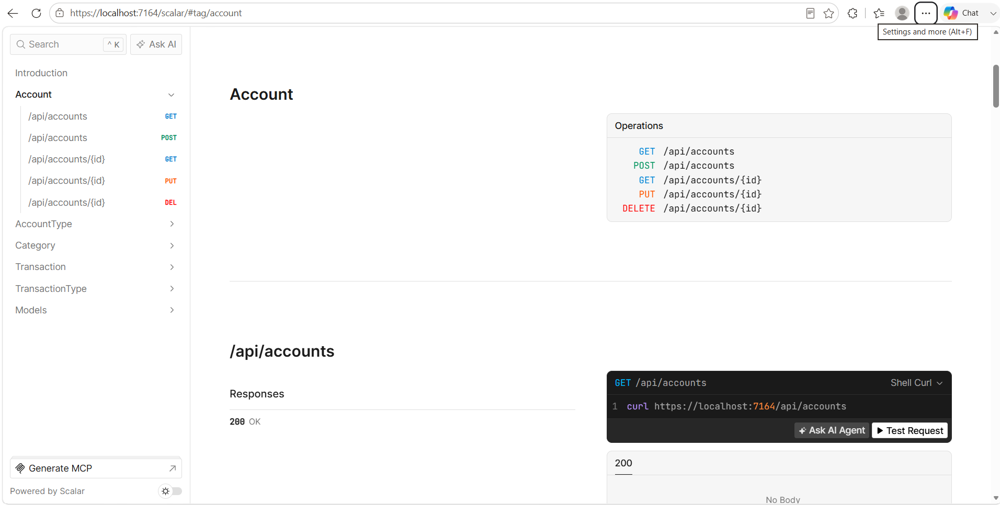
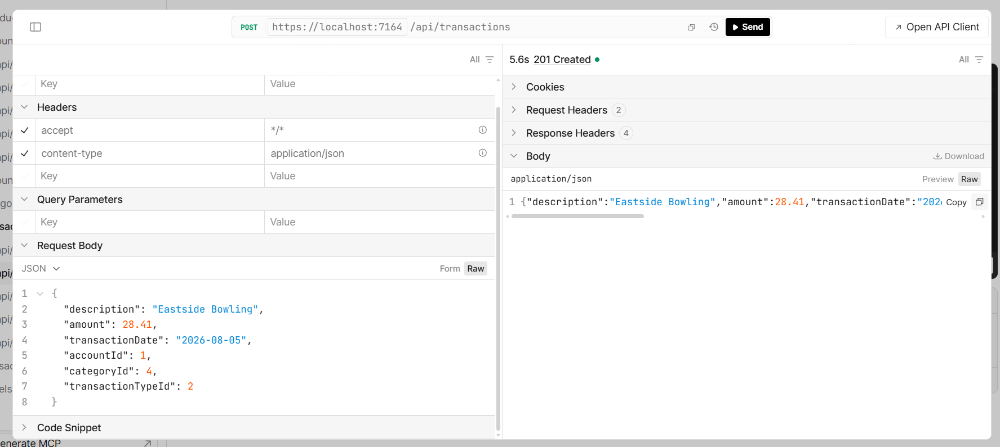
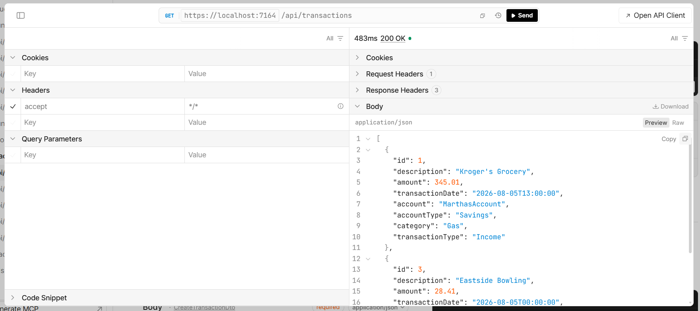

# Personal Finance Tracker API

A RESTful ASP.NET Core Web API for managing personal finance data, including accounts, categories, and transactions.

This project demonstrates building a traditional controller-based RESTful API using modern ASP.NET Core practices, including DTOs, service-layer architecture, Entity Framework Core, SQL Server, and centralized exception handling.

## Features

### CRUD Operations

* Account CRUD operations
* Account Type CRUD operations
* Category CRUD operations
* Transaction CRUD operations
* Transaction Type CRUD operations

### API Architecture

* Traditional ASP.NET Core Controllers
* DTO-based data transfer
* Service layer for business logic
* Separate query and command services
* Dependency Injection
* Entity Framework Core
* SQL Server
* Entity relationships and foreign-key validation
* Asynchronous database operations

### Querying, Filtering, Sorting, and Pagination

* Account filtering by account type
* Account filtering by active/inactive status
* Account searching by account name
* Transaction searching by description
* Transaction filtering by account, category, transaction type, and date range
* Transaction sorting by supported fields
* Transaction pagination
* Configurable page size and page number
* Total result count and total page information


### Error Handling

* Global exception handling using ASP.NET Core `IExceptionHandler`
* Custom `NotFoundException`
* Custom `ConflictException`
* Centralized error responses

### API Documentation

* OpenAPI documentation
* Scalar API reference
* Endpoint testing through Scalar

## Architecture

The API follows a layered approach:

* **Controllers**

  * Handle HTTP requests, routing, and responses

* **DTOs**

  * Control data sent to and returned from the API
  * Separate DTOs for creating, updating, and returning data where appropriate

* **Services**

  * Contain business logic and database operations
  * Query services handle read operations
  * Command services handle create, update, and delete operations

* **Entity Framework Core**

  * Handles database access, relationships, migrations, and persistence

* **Exception Handling**

  * Provides centralized exception handling and consistent API responses

## Database Relationships

The application uses Entity Framework Core relationships between:

* Accounts and Account Types
* Transactions and Accounts
* Transactions and Categories
* Transactions and Transaction Types

Transactions can return related information such as the account name, account type, category, and transaction type.

## Technologies

* C#
* ASP.NET Core Web API
* Entity Framework Core
* SQL Server
* Scalar
* OpenAPI
* REST API
* LINQ
* Dependency Injection

## API Documentation

The API is documented and tested using Scalar.

### Scalar API Reference



### Example API Response




## Getting Started

### Prerequisites

* .NET SDK
* SQL Server
* Visual Studio or another .NET-compatible IDE

### Installation

1. Clone the repository.

2. Update the connection string in `appsettings.json`.

3. Apply the Entity Framework Core migrations:

```bash
dotnet ef database update
```

4. Run the application:

```bash
dotnet run
```

5. Open Scalar to explore and test the API endpoints.

## API Endpoints

### Accounts

```text
GET    /api/accounts
GET    /api/accounts/{id}
POST   /api/accounts
PUT    /api/accounts/{id}
DELETE /api/accounts/{id}

```
#### Account Query Parameters

The account GET endpoint supports filtering and searching:

```text
GET /api/accounts?accountTypeName=Checking&isActive=true&accountName=Primary
```

##### Parameter	& Purpose
| Parameter           | Purpose                                 |
| ------------------- | --------------------------------------- |
| `accountTypeName`   | Filters accounts by account type        |
| `isActive	Filters`  | accounts by active/inactive status      |
| `accountName	`      | Searches or filters by account name     |

### Account Types

```text
GET    /api/accounttypes
GET    /api/accounttypes/{id}
POST   /api/accounttypes
PUT    /api/accounttypes/{id}
DELETE /api/accounttypes/{id}
```

### Categories

```text
GET    /api/categories
GET    /api/categories/{id}
POST   /api/categories
PUT    /api/categories/{id}
DELETE /api/categories/{id}
```

### Transactions

```text
GET    /api/transactions
GET    /api/transactions/{id}
POST   /api/transactions
PUT    /api/transactions/{id}
DELETE /api/transactions/{id}
```

#### Transaction Query Parameters

The transaction GET endpoint supports searching, filtering, sorting, and pagination.

Example:
```text
GET /api/transactions?search=rent&sortBy=amount&sortDirection=desc&pageNumber=1&pageSize=10
```
| Parameter           | Purpose                                 |
| ------------------- | --------------------------------------- |
| `search`            | Searches transaction descriptions       |
| `accountId`         | Filters by account                      |
| `categoryId`        | Filters by category                     |
| `transactionTypeId` | Filters by transaction type             |
| `startDate`         | Filters transactions from a date        |
| `endDate`           | Filters transactions through a date     |
| `sortBy`            | Determines the field used for sorting   |
| `sortDirection`     | Sorts ascending or descending           |
| `pageNumber`        | Selects the page of results             |
| `pageSize`          | Controls the number of results per page |


### Transaction Types

```text
GET    /api/transactiontypes
GET    /api/transactiontypes/{id}
POST   /api/transactiontypes
PUT    /api/transactiontypes/{id}
DELETE /api/transactiontypes/{id}
```

## Possible Future Improvements

* Advanced validation with FluentValidation
* Logging and monitoring
* JWT authentication and authorization
* Automated testing
* Clean Architecture
* Docker support
* Deployment


